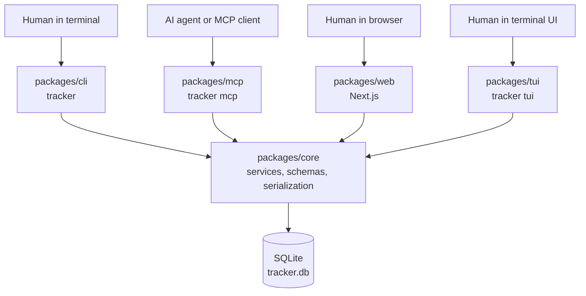

# issue-tracker

A local-first, fast, agent-native issue tracker over SQLite, shaped like Linear and built for humans and AI agents equally.

issue-tracker keeps project work on your machine, exposes the same behavior through every surface, and treats agents as first-class actors that can create, move, assign, comment on, and link work through a structured MCP protocol.

## Why

- **Speed:** local SQLite and synchronous core services keep issue operations instant.
- **Local and private:** tracker data stays in a gitignored database file on your machine.
- **Agent-native:** MCP uses the same core services as the CLI, so agents get the same behavior and JSON contracts as humans.
- **Ownership:** the code is public and hackable; the data and workflow stay yours.

## Surfaces

- `packages/core` - the brain: schema, migrations, data model, validation, serialization, and all business logic. Import it as `@issue-tracker/core`; it is not launched directly.
- `packages/cli` - `tracker`, the human terminal surface. Launch with `tracker ...` after building and linking the CLI workspace.
- `packages/mcp` - the MCP agent server. Launch with `tracker mcp`, usually with `--agent <handle>`.
- `packages/web` - the Next.js web UI for list, board, detail, and issue creation workflows. Launch with `npm run dev -w @issue-tracker/web`.
- `packages/tui` - `tracker tui`, the Linekeeper interactive terminal UI. Launch with `tracker tui`.

## Architecture

Core owns all behavior. The CLI, MCP server, web app, and Linekeeper TUI are thin adapters over the public `@issue-tracker/core` barrel: parse input, call core services with shared Zod schemas, then format output. This keeps human and machine behavior aligned.



The key rule is simple: if a rule changes issue behavior, it belongs in `packages/core`.

## Features

- Teams with Linear-style issue identifiers such as `ENG-1`.
- Projects with status, lead, start date, and target date metadata.
- Issues with workflow states, priorities, estimates, due dates, ordering, and lifecycle timestamps.
- Assignment to human or agent actors.
- Labels, cycles, parent issues, and sub-issues.
- Comments, including threaded replies.
- Repo-aware attachments for links, branches, PRs, and commits.
- Append-only activity log and JSONL activity watch.
- Archive and unarchive for issues, teams, projects, and labels.
- Saved issue views and reusable issue templates.
- Case-insensitive LIKE search over issue title and description.
- Rich issue filtering by state, assignee, project, cycle, label, team, priority, archived status, and saved view.
- Safe SQLite backup plus JSON export and import.

## Quickstart

Requirements: Node.js 22 or newer and npm.

### Getting started on a new machine

From a fresh checkout, run the setup script:

```sh
./scripts/setup.sh
```

The script installs dependencies, builds the workspaces, links the `tracker` CLI, and runs `tracker init` only when the default database does not already exist.

Manual equivalent:

```sh
git clone <repo-url>
cd issue-tracker
npm install
npm run build
npm link --workspace @issue-tracker/cli
tracker init
```

By default, tracker data lives outside the repository at `${XDG_DATA_HOME:-$HOME/.local/share}/issue-tracker/tracker.db`, or at `ISSUE_TRACKER_DB` when that environment variable is set. Because the SQLite database is separate from the repo, `git pull` updates never touch your issue data.

From a checkout:

```sh
npm install
npm run build
npm link --workspace @issue-tracker/cli
```

Use a disposable database while trying the tool:

```sh
DB=/tmp/issue-tracker-demo/tracker.db

tracker --db "$DB" init
tracker --db "$DB" project create "Platform Foundations" --status planned
tracker --db "$DB" issue create --title "Set up CI" --project "Platform Foundations" --priority 2
tracker --db "$DB" issue list --json
tracker --db "$DB" issue move ENG-1 "In Progress"
tracker --db "$DB" issue view ENG-1 --json
```

The default `tracker init` seeds the `ENG` team and the default human actor. The first issue above is the fictional example `ENG-1 "Set up CI"`.

The CLI also reads `ISSUE_TRACKER_DB`, so you can export it once:

```sh
export ISSUE_TRACKER_DB=/tmp/issue-tracker-demo/tracker.db
tracker issue search ci --json
tracker issue comment ENG-1 "CI setup is ready to review."
tracker issue link ENG-1 --kind branch --repo /tmp/example-repo --branch chore/setup-ci
```

## MCP

Run the MCP server over stdio:

```sh
tracker --db /tmp/issue-tracker-demo/tracker.db mcp --agent build-agent
```

Point an MCP client at that command:

```json
{
  "mcpServers": {
    "issue-tracker": {
      "command": "tracker",
      "args": [
        "--db",
        "/tmp/issue-tracker-demo/tracker.db",
        "mcp",
        "--agent",
        "build-agent"
      ]
    }
  }
}
```

If the agent actor does not exist yet, MCP creates it as an agent actor. MCP tools include issue listing, search, reads, creation, updates, moves, assignment, archive/unarchive, comments, links, activity, teams, projects, labels, cycles, saved views, actors, and templates.

## Web UI

The web UI uses the same database path convention as the CLI. Start it against the demo database:

```sh
ISSUE_TRACKER_DB=/tmp/issue-tracker-demo/tracker.db npm run dev -w @issue-tracker/web
```

Open the Next.js local URL printed by the dev server. The app includes an issue list with search and filters, a board view, an issue detail page, and a create issue dialog.

## Linekeeper TUI

Open the interactive terminal UI:

```sh
tracker --db /tmp/issue-tracker-demo/tracker.db tui
```

Linekeeper shows issue navigation, metadata, sub-issues, descriptions, comments, and a live agent activity feed. It can create issues, move state, update priority, assign actors, update labels, comment, create sub-issues, and link work.

## Development

This is an npm workspaces monorepo:

```text
packages/core  - core schema, migrations, services, schemas, serialization
packages/cli   - tracker command
packages/mcp   - MCP stdio server
packages/web   - Next.js app
packages/tui   - Linekeeper terminal UI
```

Local gates:

```sh
npm run typecheck
npm test
npm run build
npm run lint
```

Root scripts cover the backend workspaces and the web package. The project uses TypeScript ESM, Node.js 22+, better-sqlite3, Drizzle, Zod, Commander, MCP SDK, Next.js, Ink, and Vitest.

## Public Code, Private Data

The repository is safe to publish, but tracker data is private. SQLite database files such as `*.db`, `*.sqlite`, WAL/SHM files, `.tracker/`, and `/data/` are gitignored. Keep examples fictional; this README uses `ENG-1 "Set up CI"`.

See [docs/SPEC.md](docs/SPEC.md) for the product specification.
