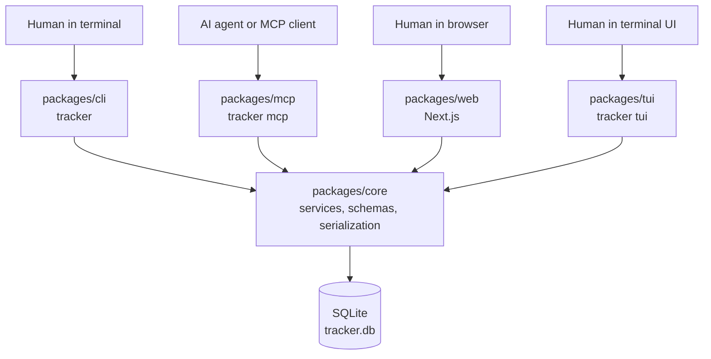

# issue-tracker

A local-first, fast, agent-native issue tracker over SQLite, shaped like Linear and built for humans and AI agents equally.

issue-tracker keeps project work on your machine, exposes the same behavior through every surface, and treats agents as first-class actors that can create, move, assign, comment on, and link work through a structured MCP protocol.

## Why

- **Speed:** local SQLite and synchronous core services keep issue operations instant.
- **Local and private:** tracker data stays in a gitignored database file on your machine.
- **Agent-native:** MCP uses the same core services as the CLI, so agents get the same behavior and JSON contracts as humans.
- **Ownership:** the code is public and hackable; the data and workflow stay yours.

## Surfaces

- `packages/core` - the brain: schema, migrations, data model, validation, serialization, and all business logic. Import it as `@issue-tracker/core`; it is not launched directly.
- `packages/cli` - `tracker`, the human terminal surface. Launch with `tracker ...` after building and linking the CLI workspace.
- `packages/mcp` - the MCP agent server. Launch with `tracker mcp`, usually with `--agent <handle>`.
- `packages/web` - the Next.js web UI for list, board, detail, and issue creation workflows. Launch with `npm run dev -w @issue-tracker/web`.
- `packages/tui` - `tracker tui`, the Linekeeper interactive terminal UI. Launch with `tracker tui`.

## Architecture

Core owns all behavior. The CLI, MCP server, web app, and Linekeeper TUI are thin adapters over the public `@issue-tracker/core` barrel: parse input, call core services with shared Zod schemas, then format output. This keeps human and machine behavior aligned.


```mermaid
flowchart TD
    Human[Human in terminal] --> CLI[packages/cli<br/>tracker]
    Agent[AI agent or MCP client] --> MCP[packages/mcp<br/>tracker mcp]
    Browser[Human in browser] --> Web[packages/web<br/>Next.js]
    TerminalUI[Human in terminal UI] --> TUI[packages/tui<br/>tracker tui]

    CLI --> Core[packages/core<br/>services, schemas, serialization]
    MCP --> Core
    Web --> Core
    TUI --> Core

    Core --> DB[(SQLite<br/>tracker.db)]
```

The key rule is simple: if a rule changes issue behavior, it belongs in `packages/core`.

## Features

- Teams with Linear-style issue identifiers such as `ENG-1`.
- Projects with status, lead, start date, and target date metadata.
- Issues with workflow states, priorities, estimates, due dates, ordering, and lifecycle timestamps.
- Assignment to human or agent actors.
- Labels, cycles, parent issues, and sub-issues.
- Comments, including threaded replies.
- Repo-aware attachments for links, branches, PRs, and commits.
- Append-only activity log and JSONL activity watch.
- Archive and unarchive for issues, teams, projects, and labels.
- Saved issue views and reusable issue templates.
- Case-insensitive LIKE search over issue title and description.
- Rich issue filtering by state, assignee, project, cycle, label, team, priority, archived status, and saved view.
- Safe SQLite backup plus JSON export and import.

## Quickstart

Requirements: Node.js 22 or newer and npm.

### Getting started on a new machine

From a fresh checkout, run the setup script:

```sh
./scripts/setup.sh
```

The script installs dependencies, builds the workspaces, links the `tracker` CLI, and runs `tracker init` only when the default database does not already exist.

Manual equivalent:

```sh
git clone <repo-url>
cd issue-tracker
npm install
npm run build
npm link --workspace @issue-tracker/cli
tracker init
```

By default, tracker data lives outside the repository at `${XDG_DATA_HOME:-$HOME/.local/share}/issue-tracker/tracker.db`, or at `ISSUE_TRACKER_DB` when that environment variable is set. Because the SQLite database is separate from the repo, `git pull` updates never touch your issue data.

From a checkout:

```sh
npm install
npm run build
npm link --workspace @issue-tracker/cli
```

Use a disposable database while trying the tool:

```sh
DB=/tmp/issue-tracker-demo/tracker.db

tracker --db "$DB" init
tracker --db "$DB" project create "Platform Foundations" --status planned
tracker --db "$DB" issue create --title "Set up CI" --project "Platform Foundations" --priority 2
tracker --db "$DB" issue list --json
tracker --db "$DB" issue move ENG-1 "In Progress"
tracker --db "$DB" issue view ENG-1 --json
```

The default `tracker init` seeds the `ENG` team and the default human actor. The first issue above is the fictional example `ENG-1 "Set up CI"`.

The CLI also reads `ISSUE_TRACKER_DB`, so you can export it once:

```sh
export ISSUE_TRACKER_DB=/tmp/issue-tracker-demo/tracker.db
tracker issue search ci --json
tracker issue comment ENG-1 "CI setup is ready to review."
tracker issue link ENG-1 --kind branch --repo /tmp/example-repo --branch chore/setup-ci
```

## MCP

Run the MCP server over stdio:

```sh
tracker --db /tmp/issue-tracker-demo/tracker.db mcp --agent build-agent
```

Point an MCP client at that command:

```json
{
  "mcpServers": {
    "issue-tracker": {
      "command": "tracker",
      "args": [
        "--db",
        "/tmp/issue-tracker-demo/tracker.db",
        "mcp",
        "--agent",
        "build-agent"
      ]
    }
  }
}
```

If the agent actor does not exist yet, MCP creates it as an agent actor. MCP tools include issue listing, search, reads, creation, updates, moves, assignment, archive/unarchive, comments, links, activity, teams, projects, labels, cycles, saved views, actors, and templates.

### Agent metadata discovery

Agents and skills should call the `describe` MCP tool (or `tracker describe --json`) before acting instead of hardcoding workflow states or priority labels. It returns the live team vocabulary, per-team ordered workflow states, priorities, grouped labels, projects, and current actor in one response. Use `list_states` (or `tracker team states <team> --json`) when only one team's workflow states are needed.

## Web UI

The web UI uses the same database path convention as the CLI. Start it against the demo database:

```sh
ISSUE_TRACKER_DB=/tmp/issue-tracker-demo/tracker.db npm run dev -w @issue-tracker/web
```

Open the Next.js local URL printed by the dev server. The app includes an issue list with search and filters, a board view, an issue detail page, and a create issue dialog.

## Linekeeper TUI

Open the interactive terminal UI:

```sh
tracker --db /tmp/issue-tracker-demo/tracker.db tui
```

Linekeeper shows issue navigation, metadata, sub-issues, descriptions, comments, and a live agent activity feed. It can create issues, move state, update priority, assign actors, update labels, comment, create sub-issues, and link work.

## Development

This is an npm workspaces monorepo:

```text
packages/core  - core schema, migrations, services, schemas, serialization
packages/cli   - tracker command
packages/mcp   - MCP stdio server
packages/web   - Next.js app
packages/tui   - Linekeeper terminal UI
```

Local gates:

```sh
npm run typecheck
npm test
npm run build
npm run lint
```

Root scripts cover the backend workspaces and the web package. The project uses TypeScript ESM, Node.js 22+, better-sqlite3, Drizzle, Zod, Commander, MCP SDK, Next.js, Ink, and Vitest.

## Public Code, Private Data

The repository is safe to publish, but tracker data is private. SQLite database files such as `*.db`, `*.sqlite`, WAL/SHM files, `.tracker/`, and `/data/` are gitignored. Keep examples fictional; this README uses `ENG-1 "Set up CI"`.

See [docs/SPEC.md](docs/SPEC.md) for the product specification.

### Input validation for agents

MCP validates complete schemas, including unknown properties and refinements.
Issue updates require at least one supplied field (empty arrays alone do not count).
Use either a reference (`team`, `state`, `assignee`, `project`, `cycle`, `parent`)
or its `Id` alias, never both. References accept the names/handles/identifiers
advertised by each tool; IDs are exact. Omit a field to preserve it; explicit
`null` clears a nullable field. `labels`, `blockedBy`, and `blocks` add entries;
use the corresponding remove fields to remove them. Page limits are integers
from 1 through 250 (paginated issue reads default to 50). Search splits free text
into alphanumeric tokens and ANDs their prefix matches; it does not execute FTS
operators supplied in the query.

### Concurrent issue writes

Full issue reads include a monotonic `revision`. Pass `expectedRevision` to issue
updates, moves, assignment, archive/unarchive, comments, or attachments (CLI:
`--expected-revision`). A stale write returns `ISSUE_CONFLICT` with the current
revision; reread before deciding whether to retry. Scalar changes and direct
label, dependency (both endpoints), comment, and attachment changes increment
revisions transactionally, including writes at the same clock timestamp.
An operation affecting several relations may increment more than once. Revisions
are change tokens, not counts of user actions. Scalar no-ops leave revision and
activity unchanged.

`claim_issue` / `tracker issue claim ENG-1 --json` atomically assigns active,
unassigned backlog/unstarted work to the current actor. A second claim conflicts,
including a replay by the same actor; there is no lease or automatic expiry.
Release ownership through ordinary assignment with a null actor. Claims do not
change workflow state or guarantee dependencies are satisfied.

### Compact mutation receipts

Issue create/update/move/assign/archive/unarchive accept `response: "compact"`
(CLI: `--response compact --json`). The default remains `full` for compatibility.
Compact JSON contains `identifier`, `changed`, sorted `changedFields`, `revision`,
`updatedAt`, and `alreadyExisted` (null for non-create operations). It reports
field names, never their potentially large contents; use an explicit issue read
for values. Scalar no-ops and idempotent create replays return `changed: false`.
Before/after comparison and mutation run in one transaction. Full responses
retain descriptions, relations, and the normal comment paging behavior.

### Scoped discovery

Use `describe({team:"ENG", sections:["teams","priorities"], compact:true})`
(or `tracker describe --team ENG --sections teams,priorities --compact --json`).
Omitted sections default to the legacy complete metadata response. `compact`
returns project ID/name/status only; project descriptions remain available in
full mode. Team scope applies to teams/states; labels and projects are global
in this data model. `metadataRevision` is SHA-256 of the selected response
content: cache by the normalized request and revision; only changes visible in
that response invalidate it. It is not a workspace-wide edit counter.

List/search projection now accepts `stateName`, `stateType`, `assigneeHandle`,
and `revision`, e.g. `--fields stateName,assigneeHandle,revision`. Unassigned
handles are explicit null; archived actor references remain readable.

### Finding actionable work

`list_issues` and `search` accept `ready`, `stateType`, `parent` (null means no
parent), `blockedBy`, `blocks`, `repository`, `updatedSince`, inclusive `dueFrom`
and `dueTo`, and `sort` (`identifier`, `priority`, `updatedAt`). Saved views retain
these filters. Corresponding CLI flags use kebab-case; `--not-ready` selects the
complement of readiness. CLI search also accepts the ordinary list filters.

Ready means non-archived backlog/unstarted work with no non-archived blocker in a
nonterminal state. Completed, canceled, or archived blockers do not prevent
readiness. Assignment is separate: add `assignee:null` / `--unassigned` to select
available work. Repository matching follows the existing resolver: active issue
associations replace project associations; absent active overrides, project
associations apply. Priority sorts 1–4 then 0, and updatedAt sorts newest first;
team/number/ID break ties. Search remains relevance-ranked unless sort is explicit.

### Issue cursor consistency

New list/search responses emit opaque `it1.*` cursors. Reuse the same filters and
sort; limit and projected fields may change. Default identifier-ordered lists
use a team/number/ID key, so removing earlier results does not skip later ones.
This is a live forward traversal: records newly entering before the last key are
seen only on a new traversal. Team key changes invalidate the query binding.
Priority/updatedAt sorts and relevance search additionally bind a result
fingerprint; changed results return `ISSUE_CURSOR_STALE`. Restart without a cursor
and reconcile already-seen identifiers. Page/fingerprint reads share one database
snapshot. Invalid/cross-query/cross-tool cursors return `VALIDATION_FAILED`.
Legacy numeric offsets are temporarily accepted as input for compatibility (with
their original weaker semantics); every new continuation is opaque. Comment
cursors retain their separate existing contract.

### Bounded issue details

`get_issue({identifier:"ENG-1", fields:["title","description"], maxBytes:4096})`
returns a selection envelope: `data`, `omittedFields`, `snapshot`, and the
`read_issue_section` retrieval tool. The budget is serialized UTF-8 JSON bytes,
not tokens (1–64 KiB, default 16 KiB). Omitted fields are never silently discarded.
Legacy get_issue without fields/maxBytes retains its existing full response and
comment options. Do not combine bounded selection with legacy comment options.

`get_issues` reads 1–10 identifiers with a **total** budget (8–64 KiB, default
16 KiB), shared evenly. Unknown issues fail the batch. CLI equivalents:
`issue view ENG-1 --fields title,description --max-bytes 4096 --json` and
`issue read-many ENG-1 ENG-2 --fields title,description --json`.

Read omitted content with `read_issue_section({identifier:"ENG-1",
path:["description"], snapshot:"...", maxBytes:4096})`. Follow `nextCursor` and
concatenate string `value` chunks exactly; Unicode characters are not split.
Arrays (comments, children, attachments, dependencies) page independently with
`limit` and a byte budget. Oversized array entries are null placeholders with
explicit `omittedPaths`; read each indicated path (e.g. `["comments",0]`, then
`["comments",0,"body"]`) to recover its content. Objects omit oversized fields
with the same path mechanism. Comments in this section API include the complete
history, so older comments are reachable without guessing a legacy offset.
CLI: `issue read-section ENG-1 --path comments.0.body --max-bytes 4096 --json`.
Pass the selection's snapshot to require consistent content. Section cursors bind
path and source snapshot; changed data returns ISSUE_CURSOR_STALE and requires a
fresh selection. Budgets bound output, not database hydration; selective loading
optimization remains separate work.

### Native MCP tool profiles

Start `tracker mcp --agent build-agent --tool-profile coding` to advertise 15
common coding tools, including scoped discovery, search, selective/section reads,
mutations, claims, saved-view discovery, and template discovery. `orchestration`
adds run lifecycle, repository, engine, and profile tools. `admin` and `full`
advertise everything; `full` remains the default. Each registration declares its
capability group in MCP metadata; the profile derives its list from that metadata.

Profiles filter **advertisement only**, not execution or permissions. Known calls
and aliases (including get_current_actor) remain compatible, and resources are
unchanged. The coding profile advertises whoami only, not both identity aliases.
The separate mcp-tool-filter proxy also filters discovery only. Use the native
profile directly instead of combining overlapping filters unless that is intended.
