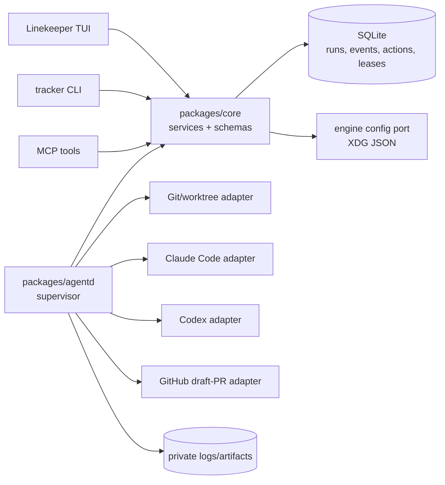
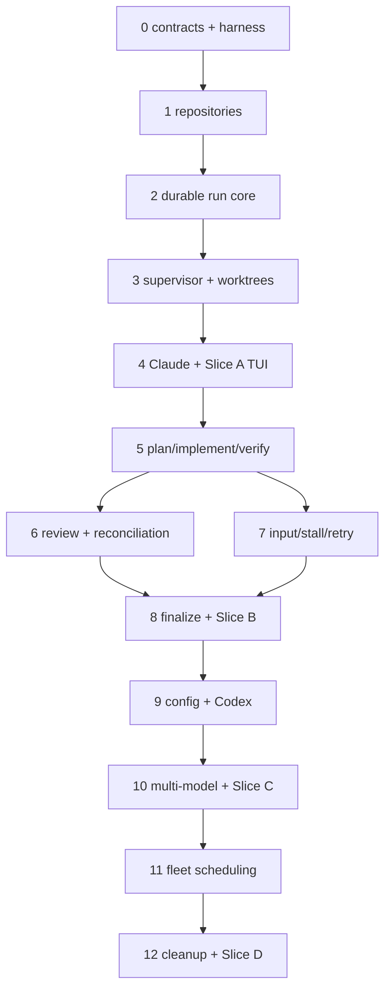

# Autonomous Coding Runs — Implementation Plan

> Delivery plan for [`AUTONOMOUS_CODING_RUNS_PRD.md`](./AUTONOMOUS_CODING_RUNS_PRD.md).
> The PRD defines the product; this document fixes the implementation order,
> architecture, and acceptance gates.

**Status:** Draft v0.1 · **Last updated:** 2026-07-17 · **Target:** Post-M2 product
slice, delivered as four independently useful releases

---

## 1. Outcome and sequencing rule

Build one durable control plane before broadening provider, workflow, or fleet
capabilities. The first end-to-end path is:

```text
register repository
  -> preview a run
  -> persist run + initial event
  -> supervisor claims durable action
  -> provision isolated worktree
  -> launch a fixture or Claude participant
  -> stream normalized progress
  -> stop or finish
  -> close and reopen Linekeeper
  -> reconstruct the same run from SQLite
```

Every later phase extends this path. A phase is complete only when its **Done when**
gate passes with behavioral tests. Provider self-reports, process exit codes, and
manual demonstrations do not substitute for those gates.

The delivery slices from PRD §21 remain the release boundaries:

| Release | Product result                                                                                                           |
| ------- | ------------------------------------------------------------------------------------------------------------------------ |
| Slice A | One durable, isolated, Claude-capable run can be launched, monitored, stopped, and recovered through all three surfaces. |
| Slice B | The built-in workflow can produce a verified draft pull request or an accurate failure with recovery artifacts.          |
| Slice C | Users can assign Claude Code and Codex engines to roles, with explicit fallback and cross-model review evidence.         |
| Slice D | A small fleet can run safely across repositories, with concurrency, recovery, and cleanup controls.                      |

## 2. Non-negotiable implementation rules

1. **Core is authoritative.** Run validation, lifecycle transitions, concurrency
   guards, event sequencing, issue state changes, verification gates, and review
   floors live in `packages/core`.
2. **External effects use a durable outbox.** Worktree, process, provider, Git, and
   pull-request operations are represented as persisted actions. The supervisor
   leases an action, performs it idempotently, and reports the result through core.
3. **No adapter writes SQLite directly.** CLI, MCP, TUI, and the supervisor import
   the public `@issue-tracker/core` barrel and call core services.
4. **Run creation precedes execution.** The run, initial attempt, participants,
   resolved launch snapshot, `run.created` event, issue activity breadcrumb, and
   first queued action are one transaction.
5. **Facts remain distinct.** Workflow phase, execution state, participant state,
   process liveness, verification result, and provider self-report are separate
   fields or records.
6. **History is append-only.** Events and completed attempts are never rewritten.
   Retry and fallback create attempts; terminal runs never return to `running`.
7. **No terminal success without evidence.** `succeeded` requires the workflow's
   structured result, independent verification, required reviews, and artifact
   reconciliation.
8. **External effects are explicit.** Push, draft pull request, permission grants,
   force-stop, worktree cleanup, and log cleanup are separately authorized actions.
9. **Tests use fictional data and fake providers.** CI never requires provider
   credentials, a network remote, or a developer's global Git configuration.
10. **Raw logs stay private.** They live below the Issue Tracker data directory,
    are referenced by checksum, and are excluded from ordinary activity and default
    export.

## 3. Decisions fixed for the first release

These resolve PRD §23 so implementation does not stall on cross-cutting choices.

| Question                | Initial decision                                                                                                                                                                                                       | Consequence                                                                                                                                                                              |
| ----------------------- | ---------------------------------------------------------------------------------------------------------------------------------------------------------------------------------------------------------------------- | ---------------------------------------------------------------------------------------------------------------------------------------------------------------------------------------- |
| Engine storage          | Store non-secret machine-local engine definitions in `${XDG_CONFIG_HOME:-$HOME/.config}/issue-tracker/engines.json`. Validate them with core Zod schemas.                                                              | Executable paths and local provider choices do not become portable workspace data. Environment entries name an allowlisted variable; values are inherited and never persisted.           |
| Profile storage         | Store named, non-secret orchestration profiles in SQLite.                                                                                                                                                              | Profiles are queryable through core/CLI/MCP/TUI and included in backup/export. Every run stores an immutable resolved snapshot.                                                          |
| Supervisor packaging    | Add `packages/agentd` with the `tracker-agentd` executable. The first release requires the user to start it explicitly.                                                                                                | Linekeeper shows supervisor health and startup instructions; it never owns provider children. A later `tracker agentd` launcher may be added only without moving runtime rules into CLI. |
| Supervisor coordination | Use SQLite leases and a durable action outbox; use polling plus bounded backoff initially.                                                                                                                             | Restart recovery and double-claim prevention do not depend on an in-memory queue or a long-lived UI connection.                                                                          |
| Permission posture      | The built-in profile permits autonomous commands only inside the managed worktree. Writes outside it, push, draft-PR publication, and provider permission escalation require explicit profile policy or user approval. | Autonomy is useful locally while externally visible and broader host effects stay conspicuous. Merge is always human-only in this release.                                               |
| Repository routing      | A project supplies ordered repository defaults; an issue may override them. More than one resolved repository requires explicit launch confirmation.                                                                   | Single-repository runs stay frictionless; ambiguous routing never silently chooses a checkout.                                                                                           |
| Command representation  | Store setup, test, and verification commands as `{ executable, args, envNames }`, not shell strings.                                                                                                                   | The supervisor uses argument arrays without implicit shell evaluation. A future explicit `shell` command type can have a separate policy.                                                |
| Worktree and logs       | Put worktrees below `${XDG_DATA_HOME:-$HOME/.local/share}/issue-tracker/worktrees/<run-id>/` and logs below `.../runs/<run-id>/`.                                                                                      | Cleanup can validate exact managed paths. Worktrees and private logs do not enter public repositories.                                                                                   |
| Issue transitions       | Profiles may map run events to workflow state names. The built-in default moves to the team's `started` state on successful provisioning and otherwise leaves issue state unchanged unless a target is configured.     | Launch failure never falsely starts an issue; projects with a review state can opt into a PR-ready transition.                                                                           |
| Resume and retry        | Resume keeps an attempt only when the same explicit provider session and worktree can continue. Otherwise recovery creates a new retry attempt.                                                                        | No command relies on a provider's ambiguous “last session.”                                                                                                                              |
| Raw-log retention       | Retain logs until explicit cleanup in the first release. Exclude them from export unless `includeRawLogs` is explicitly selected.                                                                                      | Recovery is favored before automatic retention policy is proven.                                                                                                                         |
| Pull requests           | Implement a publisher port with GitHub CLI (`gh`) as the first adapter. It may create a draft PR but exposes no merge operation.                                                                                       | Provider authentication remains native to `git`/`gh`, and the verified branch survives publication failure.                                                                              |

Configuration file reads, XDG path resolution, and executable discovery are injected
at service boundaries so tests never depend on the real home directory, `PATH`, or
process environment.

## 4. Architecture



The supervisor is deliberately not the state machine. Core decides which transition
or next action is legal. The supervisor only:

1. claims a queued action with a time-bounded lease;
2. performs the external operation with a stable idempotency key;
3. heartbeats while the operation or participant is live;
4. reports normalized observations and artifacts; and
5. asks core to complete, fail, or release the action.

### 4.1 Durable action protocol

External work cannot share a database transaction with SQLite. Each handler must
therefore be safe after a crash between the side effect and its recorded completion.

- Every action has a stable `idempotencyKey`, kind, validated payload, state,
  lease owner, lease expiry, attempt count, result, and timestamps.
- Claiming changes `queued -> claimed` in an immediate transaction and succeeds for
  only one supervisor.
- Heartbeats extend a live lease. An expired lease becomes reclaimable only after
  reconciliation checks the process, provider session, filesystem, and prior artifact.
- Worktree, branch, commit, push, and PR handlers inspect current external state before
  creating anything. A matching result is adopted; a conflict fails explicitly.
- Completing an action, appending the corresponding run event, updating run state,
  and enqueueing the next action happen in one core transaction.
- User commands such as stop, respond, approve, nudge, resume, and retry are also
  persisted requests. A UI process never writes to a provider stdin directly.

### 4.2 Initial package/file shape

```text
packages/
├── core/
│   ├── src/db/schema.ts
│   ├── src/migrations/
│   ├── src/schemas/
│   │   ├── engine.ts
│   │   ├── repository.ts
│   │   ├── profile.ts
│   │   └── run.ts
│   ├── src/services/
│   │   ├── engine.ts
│   │   ├── repository.ts
│   │   ├── profile.ts
│   │   ├── run.ts
│   │   ├── run-action.ts
│   │   ├── run-artifact.ts
│   │   ├── run-event.ts
│   │   ├── run-input.ts
│   │   ├── run-review.ts
│   │   └── run-workflow.ts
│   └── src/serialize.ts
├── agentd/
│   ├── src/index.ts
│   ├── src/supervisor.ts
│   ├── src/reconcile.ts
│   ├── src/worktrees.ts
│   ├── src/commands.ts
│   ├── src/artifacts.ts
│   ├── src/adapters/
│   │   ├── contract.ts
│   │   ├── fake.ts
│   │   ├── claude-code.ts
│   │   └── codex.ts
│   └── src/publishers/github-cli.ts
├── cli/src/                 # repository/profile/run commands
├── mcp/src/                 # equivalent tools over shared schemas
└── tui/src/                 # launch, run detail, fleet, input, controls
```

The exact split may consolidate small modules, but it must preserve the core/runtime
boundary and the public core barrel.

## 5. Data model and database constraints

Add the following through checked-in Drizzle migrations. JSON columns are parsed and
validated by versioned Zod schemas on both write and read; malformed stored JSON is a
structured data-integrity error, never an unchecked cast.

### 5.1 Repository and configuration tables

- `repositories`: stable UUID, unique normalized name, unique canonical path,
  default branch, optional remote, setup/test/verification `CommandSpec`, archival
  timestamp, created/updated timestamps.
- `project_repositories`: project/repository pair, position, and `isDefault`; one
  default per project.
- `issue_repositories`: issue/repository pair, position, and override kind. Presence
  replaces project defaults for launch routing.
- `orchestration_profiles`: unique name, workflow identifier, schema version,
  validated JSON configuration, default flag, archival and audit timestamps.

Repository canonicalization happens before uniqueness checks. Registration verifies
that the path is an existing Git worktree and records its common-dir identity so the
same repository cannot be registered twice through symlinks or linked worktrees.

### 5.2 Run protocol tables

- `agent_runs`: issue, optional source profile, workflow and schema versions,
  immutable resolved configuration, current phase/state, primary repository,
  base ref and resolved base commit, branch/worktree, event and attempt counters,
  started/event/progress/completed timestamps, outcome, and structured error.
- `run_repositories`: the exact ordered repositories resolved for the run, including
  per-repository base commit, worktree, branch, and primary flag.
- `run_attempts`: monotonic number within a run, reason, requested and actual engine
  snapshots, state, timestamps, normalized result, and error.
- `run_participants`: attempt, actor, role, adapter, requested/actual model,
  provider session ID, capability snapshot, process identity, state, and liveness
  timestamps.
- `run_events`: monotonic run sequence, attempt, optional participant, normalized
  type, versioned data, optional provider event ID, and created timestamp.
- `run_artifacts`: run/attempt, kind, title, local path or URL, SHA-256, validated
  metadata, related issue attachment, and created timestamp.
- `run_input_requests`: participant, request kind (`input` or `permission`), prompt,
  proposed operation/scope, blocking flag, state, response/decision, requesting and
  responding actors, and timestamps.
- `run_verifications`: command snapshot, start/end times, exit status, classification,
  log artifact, and parsed summary.
- `run_review_findings`: reviewer participant, stable fingerprint, severity,
  binding/adversarial source, file/location, summary, evidence, resolution, and the
  final reconciliation class (`agreed`, `binding_only`, `adversary_only`).
- `run_actions`: durable external-effect outbox described in §4.1.
- `supervisor_instances`: instance ID, process identity, version, capability summary,
  started and last heartbeat timestamps. Stale rows are history, not proof of liveness.

### 5.3 Enforced invariants

Use database constraints where SQLite can express them and core transactions for
cross-row rules.

- Partial unique index: one non-terminal run per issue unless the launch explicitly
  selects an override slot. Override runs carry a unique `parallelGroup` and always
  have separate worktrees.
- Partial unique index: one active attempt per run.
- Unique `(runId, number)` for attempt numbering.
- Unique `(runId, sequence)` for event ordering. Increment the run's event counter and
  insert the event in the same immediate transaction.
- Unique non-null `(participantId, providerEventId)` for ingestion idempotency.
- Unique action idempotency key and repository worktree path.
- Terminal timestamps are required for terminal states and absent for active states.
- `waiting_for_input` is entered only while an unresolved blocking request exists.
- `succeeded` is reachable only through the workflow completion service after all
  configured gates pass.
- Foreign keys use restrictive deletion. Product services archive records; they do
  not hard-delete run history.

All timestamps come from the injected core clock. Deterministic lists order by stable
business order plus ID/sequence tie-breakers.

## 6. Core contracts

### 6.1 Launch preview and start

`previewRun` performs no mutation. It returns:

- resolved issue, repositories, base refs, and proposed managed worktree paths;
- profile plus per-role requested/actual engine and model mapping;
- adapter capability compatibility;
- command, permission, isolation, fallback, push, PR, and merge policies;
- dirty checkout and instruction-file observations;
- missing executable, repository, base ref, verification, or role errors;
- warnings requiring explicit confirmation, including dirty or multi-repository
  routing; and
- a short-lived preview fingerprint over all resolved inputs.

`startRun` re-resolves and compares the fingerprint so confirmation cannot launch a
different plan after configuration changes. It rejects stale previews and, in one
transaction, creates the run graph and first action. Dirty source checkouts are
reported but do not contaminate the new worktree; an unresolved or moving base ref is
revalidated at start.

### 6.2 Lifecycle API

Core exposes small operations rather than a generic “set state” escape hatch:

- `claimRunAction`, `heartbeatRunAction`, `completeRunAction`, `failRunAction`
- `recordProviderEvent`, `recordProcessExit`, `recordArtifact`
- `requestRunInput`, `respondToRunInput`, `resolveRunPermission`
- `requestRunStop`, `confirmRunStopped`, `markRunStalled`
- `resumeRun`, `retryRun`, `startFallbackAttempt`
- `recordVerification`, `recordReviewFinding`, `reconcileReview`
- `completeRunWorkflow`, `failRun`, `cancelRun`, `markRunCrashed`

Each operation validates the expected phase/state/attempt/action version to reject
stale supervisor work. Transition and event insertion share one transaction. Core
emits only the high-value issue activity breadcrumbs listed in PRD §19.

### 6.3 Workflow representation

The first release does not build a general workflow language. `issue-delivery` is a
versioned reducer in core:

```text
(run snapshot, completed action or observation)
  -> validated state transition
  -> normalized events
  -> zero or more next durable actions
```

Its phases are fixed: `preflight`, `plan`, `implement`, `verify`, `review`, `finalize`,
`complete`. Profile settings choose engines and policies but cannot disable required
verification, make the implementer its sole reviewer, permit automatic merge, or turn
missing evidence into success.

## 7. Phased delivery

### Phase 0 — Contract and migration harness

- Add shared run/repository/profile enums, schemas, DTOs, error codes, and JSON schema
  versioning to core.
- Add migration tests that upgrade a populated pre-run database without changing
  existing issues, attachments, or activity.
- Add a reusable fake clock, temporary Git repository fixture, fake engine catalog,
  fake provider stream, and fake command/PR executors.
- Add architecture tests or lint restrictions that prevent `packages/agentd` from
  importing core internals or Drizzle.
- Document fixture event versions so recorded provider streams can evolve without
  silently changing normalized behavior.

**Done when:** the existing test suite remains green; a fixture database upgrades and
round-trips; invalid enum/JSON payloads return the standard error envelope; and the
new package skeleton builds without any provider installed.

### Phase 1 — Repository registry vertical slice

- Add repository and project/issue association migrations and core services.
- Canonicalize paths, verify Git identity, resolve default branch/base commit, and
  validate command specs.
- Add archive behavior and prevent new launches from archived repositories while
  retaining historical references.
- Add CLI commands `tracker repo add|list|view|archive|associate`.
- Add equivalent MCP tools using the same schemas.
- Add a small Linekeeper repository/profile settings readout needed by launch preview;
  full editing may remain CLI/MCP-first in this phase.

**Done when:** registering the same repository through a symlink is rejected; project
inheritance and issue override resolve deterministically; invalid paths and missing
test commands are visible before launch; and CLI/MCP JSON is byte-equivalent for a
fictional temporary repository.

### Phase 2 — Durable run state machine and event feed

- Add the run, attempt, participant, event, artifact, request, verification, review,
  action, and supervisor migrations from §5.
- Seed a versioned, non-editable single-engine `issue-delivery` profile that names a
  `claude-default` engine. Slice A uses this profile; user-created and multi-role
  profiles arrive in Phase 9.
- Implement preview, start, list, view, transition, append-event, and artifact services.
- Implement transactional counters, active-run/attempt guards, idempotent provider
  events, and issue activity breadcrumbs.
- Add cursor-based `listRunEvents` with deterministic JSON and JSONL-ready output.
- Add CLI `run preview|start|list|view|events` and MCP parity.
- Extend export/import/backup for structured repository/profile/run history; raw logs
  remain excluded.

**Done when:** a test starts a queued run without launching a process, observes exactly
one initial event and action, rejects a second active run, accepts an explicit parallel
run with a distinct worktree, rejects illegal/terminal transitions, and proves CLI/MCP
parity for run detail and event cursors.

### Phase 3 — Supervisor, worktree isolation, and crash reconciliation

- Implement `tracker-agentd`, supervisor instance heartbeats, atomic action leasing,
  bounded polling, graceful shutdown, and expired-lease reconciliation.
- Implement idempotent Git worktree/branch provisioning under the managed data root.
- Implement command execution with argument arrays, stdout/stderr log artifacts,
  process identity, graceful stop, and force-stop timeout.
- Add a scripted fake provider adapter that emits the same adapter contract used by
  real providers.
- On startup, reconcile claimed actions and live participants before claiming queued
  work. Missing process plus missing structured result becomes `crashed`.
- Expose supervisor health through core so every surface reads the same status.

**Done when:** an integration test kills the supervisor after worktree creation but
before action completion, restarts it, adopts exactly one worktree, and completes the
action without duplicate events; closing the TUI has no effect; a vanished child is
`crashed`, never `succeeded`; and stop preserves branch, worktree, and log artifacts.

### Phase 4 — Claude Code adapter and Slice A Linekeeper controls

- Implement the minimum engine-catalog reader needed to resolve and validate the
  `claude-default` XDG entry, including executable/model/options schemas and redacted
  diagnostics. Phase 9 broadens this into named engine/profile management rather than
  replacing the Slice A format.
- Implement adapter capability declaration, installation/authentication probe,
  explicit model/working-directory launch, structured event normalization, stable
  session capture, structured terminal result, liveness, and stop.
- Store raw stream data in private log artifacts while promoting only meaningful
  normalized events to SQLite.
- Build launch preview/confirmation, issue run status line, issue Runs section, run
  summary/timeline/participant/log views, and stop control in Linekeeper.
- Check all proposed keys against the existing Linekeeper map and add render/reducer
  tests for final bindings.
- Show requested and actual Claude model values and any provider-reported mismatch.
- Use recorded provider fixtures in CI; keep an opt-in live adapter smoke script out of
  the required suite.

**Done when (Slice A):** a fictional `ENG-42` run can be previewed and launched from
Linekeeper, observed through CLI and MCP, stopped gracefully, and reconstructed after
closing/reopening Linekeeper and restarting the supervisor. CI proves this with the
fake adapter and fixture streams; an explicit local smoke check proves the installed
Claude adapter contract when credentials are available.

### Phase 5 — Built-in plan, implement, and independent verify phases

- Implement the versioned `issue-delivery` reducer and phase/action contracts.
- Construct the work order from issue description, acceptance criteria, repository
  instructions, resolved profile, and immutable base commit.
- Require plan output with files, tests, risks, and estimated size; retain plan-review
  recommendations and rejected reasons.
- Require implementer structured output and behavioral-test self-report.
- Execute registered test and verification commands independently through the
  supervisor after implementation.
- Store command, exit status, duration, log checksum, and parsed summary; classify as
  clean, honest partial, fixable partial, audit drift, blocked, or engine failure.
- Never expose provider success as run success before the verification reducer accepts
  evidence.

**Done when:** fixture workflows cover each verification classification; a clean
provider exit without the structured result fails; claimed success plus failing tests
is audit drift; verification runs inside the produced worktree at the recorded commit;
and restart at every phase boundary resumes from the first incomplete durable action.

### Phase 6 — Review, finding reconciliation, and address cycle

- Start binding and adversarial reviewers as fresh participants with explicit session
  identities. In the single-provider slice they may use the same configured engine but
  never reuse the implementer's participant/session.
- Normalize findings with stable fingerprints, severity, evidence, and source.
- Reconcile findings deterministically into `agreed`, `binding_only`, and
  `adversary_only`; preserve divergent wording and evidence.
- Block completion if a required review is absent or the implementer is the only
  reviewer.
- Queue an address-findings action for binding blockers, then re-run all required
  verification. Bound the address loop by profile policy and report honest partial
  rather than looping indefinitely.

**Done when:** tests prove missing review blocks, implementer-only review blocks,
divergent findings remain separate, addressed code is reverified, and no combination
of provider exit/results can bypass the independent-review floor.

### Phase 7 — Input, permissions, stalls, retry, and cancellation

- Add structured input and permission request views and commands to all surfaces:
  CLI `respond|approve|stop|resume|retry`, matching MCP tools, and Linekeeper modes.
- Enter `waiting_for_input` only for unresolved blocking requests; attribute responses
  to the acting user and route them to the exact live participant/session.
- Reject response delivery after participant exit or identity mismatch.
- Track `lastEventAt`, `lastProgressAt`, process heartbeat, and configurable stall
  threshold separately. A first-release stall emits a warning and recovery choices but
  does not kill the process.
- Implement wait, nudge, same-session resume, new-attempt retry, and graceful/forced
  stop. Preserve prior attempt events and artifacts.

**Done when:** the same request can be answered from TUI, CLI, and MCP with equivalent
state; duplicate response delivery is idempotent; typing at an exited participant is
rejected; no-output-but-live differs from dead; retry increments attempt number; and a
terminal run cannot return to running.

### Phase 8 — Finalize, branch/commit/PR provenance, and Slice B acceptance

- Reconcile the final worktree state against the run's base and verification commit.
- Record files changed, diff size, tests, failures, risk notes, branch, and commits as
  structured results and artifacts.
- Link branch/commit/PR artifacts to existing issue attachments transactionally with
  the matching issue activity breadcrumb.
- Implement policy-controlled push and GitHub CLI draft-PR publication. Never merge.
- Treat PR failure after verified code as `partial`, retaining recovery instructions
  and the verified branch.
- Apply the configured issue review-state transition only with its activity row in the
  same transaction.

**Done when (Slice B):** an end-to-end fake-remote run ends either in a verified draft
PR with complete issue provenance or an accurate terminal/partial result. Verification
evidence names the exact commit. PR failure preserves a usable branch. No runtime path
contains a merge action.

### Phase 9 — Engine catalog, profiles, and Codex adapter

- Extend the Slice A XDG loader to multiple named engines, strict unknown-key
  rejection, adapter-specific schemas, executable/model/capability validation,
  environment-name allowlisting, and secret redaction.
- Add profile create/list/view/archive/default services and launch-time overrides.
- Add CLI `engine list|view|validate` and `profile add|list|view|archive|default`, MCP
  equivalents, and Linekeeper profile/override selection.
- Implement Codex structured execution, explicit model/reasoning/sandbox selection,
  thread ID capture, event normalization, result schema, stop, and declared optional
  capabilities.
- Snapshot requested and actual engine/model/options/capabilities on every participant
  and attempt.

**Done when:** malformed/unsupported configuration and missing executables fail before
process launch; config and logs never reveal inherited environment values; a recorded
Codex fixture produces the same normalized contract as Claude; and changing a profile
after launch does not change an existing run snapshot.

### Phase 10 — Multi-model roles, plan opposition, fallback, and Slice C acceptance

- Resolve orchestrator, planner, implementer, verifier, binding reviewer, and
  adversarial reviewer roles from the profile.
- Enforce adapter capability requirements and reviewer independence before launch.
- Add opposing-model plan review for medium/high risk and cross-model adversarial code
  review for `full`/eligible `auto` depth.
- Implement explicit fallback policy: create a new attempt, retain requested/actual
  engines and reason, and define whether verified artifacts are retained or rebuilt.
- Display fallback and model substitution prominently in all surfaces.

**Done when (Slice C):** one provider can orchestrate while another implements; plan
and code reviews show distinct provider sessions; actual models are visible for every
participant; fallback never rewrites the original attempt; and missing opposing review
cannot be interpreted as approval.

### Phase 11 — Fleet scheduling, resume/redirect, and health

- Add global and per-repository concurrency settings, with conservative defaults and
  transactional slot acquisition.
- Queue excess work fairly by creation sequence while prioritizing explicit recovery
  of already-started runs within configured limits.
- Add the Linekeeper fleet view sorted by intervention priority, then last progress,
  with issue, repository, phase, state, participant/model, elapsed/stale time, and PR.
- Implement redirect and same-session resume only for adapters declaring those
  capabilities; otherwise offer retry with a new attempt.
- Add locally queryable operational metrics from structured state/events without a
  remote telemetry dependency.

**Done when:** tests run multiple fake providers across two temporary repositories,
never exceed either limit, never share a worktree, preserve queue order, and rebuild the
same fleet after supervisor/TUI restart. Waiting, blocked, stalled, and failed rows sort
ahead of healthy work. Bulk stop remains absent.

### Phase 12 — Retention, cleanup, export, and Slice D acceptance

- Add archive-run, remove-worktree, and remove-raw-logs as separate confirmed actions.
- Validate cleanup targets by canonical path, managed-root containment, run ownership,
  active state, unmerged state, and recorded artifact before deletion.
- Default cleanup preserves unmerged worktrees and all structured history.
- Extend export/import to include profiles and structured runs deterministically, with
  an explicit raw-log option and checksums. Extend backup acceptance to WAL-safe run
  data during supervisor activity.
- Add recovery instructions for partial cleanup and retain artifact tombstones rather
  than pretending removed files still exist.
- Run privacy/redaction, migration, long-event-stream, and multi-process soak tests.

**Done when (Slice D):** the small-fleet acceptance flow passes after process and UI
restarts; default export contains complete structured audit history and no raw prompt
text; cleanup cannot escape the managed root or remove an active/unmerged worktree by
default; and `npm run typecheck`, `npm test`, `npm run build`, and `npm run lint` pass.

## 8. Dependency order



Within a phase, core schema/service work lands before CLI/MCP/TUI adapters. CLI and MCP
can be implemented in parallel only after their shared core schemas are stable. A later
phase must not weaken an earlier acceptance gate.

## 9. Surface parity matrix

| Capability           | Core                  | CLI                             | MCP                      | Linekeeper                                                      |
| -------------------- | --------------------- | ------------------------------- | ------------------------ | --------------------------------------------------------------- |
| Repository list/view | service + DTO         | `repo list/view`                | `list/get_repositories`  | launch/settings views                                           |
| Repository mutation  | service + schema      | `repo add/archive/associate`    | equivalent tools         | launch remediation link; editing may remain CLI-first initially |
| Engine validation    | pure/injected service | `engine validate`               | equivalent tool          | launch preview diagnostics                                      |
| Profile list/view    | service + DTO         | `profile list/view`             | equivalent tools         | launch selector                                                 |
| Profile mutation     | service + schema      | `profile add/archive/default`   | equivalent tools         | optional after Slice C                                          |
| Run preview/start    | service + fingerprint | `run preview/start`             | `preview/start_run`      | `r` preview + confirm                                           |
| Run list/view/events | service + cursor      | `run list/view/events --follow` | list/get/events tools    | issue status, Runs, detail, fleet                               |
| Respond/approve      | attributed mutation   | `run respond/approve`           | equivalent tools         | structured input mode                                           |
| Stop/resume/retry    | guarded mutation      | `run stop/resume/retry`         | equivalent tools         | run controls                                                    |
| Logs/artifacts       | metadata service      | `run artifacts`                 | equivalent resource/tool | drill-down/open                                                 |

“Available in Linekeeper” means the TUI calls the same core service and schema; it does
not reproduce lifecycle logic in reducers or components.

## 10. Testing strategy

| Layer                  | Required coverage                                                                                                                                                                                           |
| ---------------------- | ----------------------------------------------------------------------------------------------------------------------------------------------------------------------------------------------------------- |
| Core unit/service      | Transition matrix, active-run/attempt guards, clocked timestamps, event/attempt sequencing, preview fingerprinting, idempotency, review floors, verification gates, redaction, deterministic serialization. |
| Migration              | Upgrade a populated pre-feature database; all new indexes/FKs fire; backup/export/import retains structured history.                                                                                        |
| Git/worktree           | Temporary repositories with local bare remotes; path collision, symlink alias, dirty checkout, moving base ref, restart adoption, branch/commit reconciliation, cleanup containment.                        |
| Supervisor integration | Fake provider processes, action lease expiry, kill/restart at every effect boundary, duplicate events, missing result, stall, graceful/forced stop, concurrency slots.                                      |
| Provider contract      | Versioned recorded Claude and Codex streams, malformed event/result, model fallback, session capture, optional capability behavior. No live credentials in CI.                                              |
| CLI/MCP parity         | Same Zod inputs, JSON/error envelopes, DTO bytes, actor attribution, cursor behavior, and mutation outcomes.                                                                                                |
| TUI                    | Reducer/key mapping, launch confirmation, priority sorting, restart reconstruction, structured input, model fallback display, and Ink render snapshots.                                                     |
| End-to-end             | One acceptance flow per Slice A–D using fictional issues, fake providers, temporary Git repositories, and a fake PR publisher.                                                                              |

Tests must assert behavior observable through public services or surfaces. Source-grep
assertions, sleeps as synchronization, provider “success” strings, and reliance on the
developer's Git/provider configuration are not acceptable.

For asynchronous tests, expose supervisor “process one action” and fake-clock hooks;
poll only on durable state with bounded deadlines. The production daemon may poll, but
the test suite should remain deterministic.

## 11. Operational and security review gates

Before Slice B is called usable:

- command execution uses argument arrays and an explicit working directory;
- environment snapshots contain names/redacted markers, never values;
- raw logs and worktrees are created with user-only permissions where supported;
- log/artifact paths are outside the public repository by default;
- provider result size and event payload size are bounded;
- malformed or oversized provider data fails safely and remains inspectable in a
  bounded raw artifact;
- SQLite busy handling and immediate transactions are exercised with the supervisor
  and a read/write surface active together;
- graceful stop has a bounded escalation path and never targets a PID without matching
  the recorded process identity; and
- no core or runtime API exposes merge.

Before Slice D is called complete:

- cleanup canonicalizes and rechecks every target immediately before deletion;
- restart reconciliation cannot double-push or create duplicate pull requests;
- export defaults have been inspected for prompts, source excerpts, environment
  values, credentials, and local absolute paths;
- concurrency limits survive two supervisor instances racing for work; and
- provider adapter fixtures are versioned with the provider executable version that
  produced them.

## 12. Release and rollout

1. Ship migrations and read-only repository/run queries before enabling run launch.
2. Keep `tracker-agentd` explicit and foreground-capable until restart reconciliation
   and logs are trustworthy; document a user-service recipe only after Slice A.
3. Gate real provider adapters behind validated engine entries. Keep the fake adapter
   test-only and impossible to select from production configuration.
4. Mark Slice A/B runs as experimental in Linekeeper until crash, privacy, and
   verification acceptance gates pass on real local repositories.
5. Add Codex and model-role configuration only after the Claude path uses the common
   adapter contract end to end.
6. Preserve backward-compatible readers for every stored configuration/event schema
   version, or provide an explicit migration before writing a new version.

## 13. Final product acceptance

The PRD is implemented when all of the following hold together:

- A selected issue launches the built-in workflow from a confirmed Linekeeper preview.
- The run survives Linekeeper exit and is accurately reconciled after supervisor
  restart.
- Phase, execution state, participant/model, liveness, progress, and evidence are
  structured and queryable through core, CLI, MCP, and Linekeeper.
- A blocking question can be answered through any surface and reaches only the exact
  live participant.
- A successful result has independent verification, required independent review, the
  exact verified commit, and issue-linked branch/commit/draft-PR provenance.
- Provider substitution, fallback, audit drift, missing review, stalls, crashes,
  partial publication, and cancellations are visible rather than collapsed into
  success.
- Multiple repositories run within durable concurrency limits and isolated worktrees.
- Structured history survives backup/export/import; private logs are local, checksummed,
  redacted where required, and excluded by default.
- Cleanup is explicit and safe, merge remains human-only, and no credentials are stored
  by Issue Tracker.
- All repository quality gates pass with no live-provider or network dependency.
