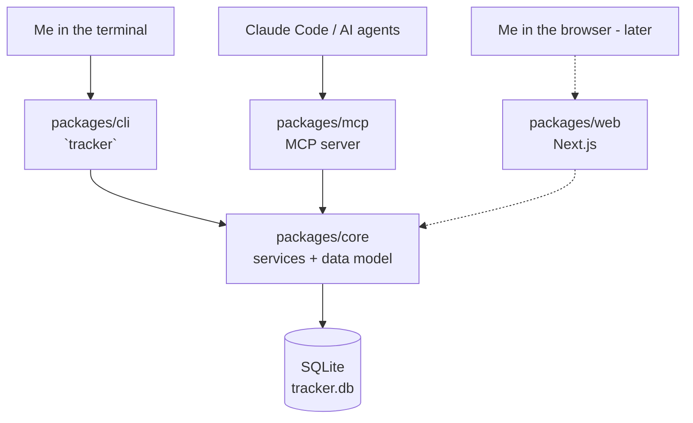
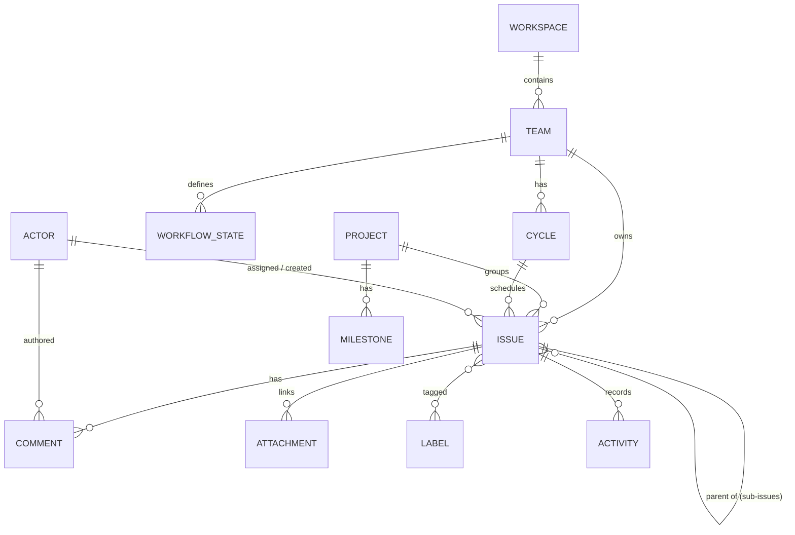

# Issue Tracker — Specification

> A local-only, fast, agent-native issue tracker. Linear-familiar workflows, running
> entirely on your machine, designed from the ground up to be driven by AI agents.

**Status:** Draft v0.1 · **Last updated:** 2026-07-05

---

## 1. Overview

This is a personal issue tracker that mirrors the way I already work in Linear —
projects, issues, cycles, priorities, statuses — but rebuilt as a **local-first**
tool that is **fast**, runs **entirely on my machine**, and treats **AI agent
orchestration as a first-class concern** rather than an afterthought.

The mental model is deliberately Linear-shaped so it feels familiar, but the
implementation is optimized for two consumers with equal weight:

1. **Me**, working quickly from the terminal.
2. **AI agents** (Claude Code and others), reading and writing issues through a
   structured protocol so they can plan, pick up, and update work autonomously.

### Why build this

- **Speed** — a local SQLite database and a CLI mean zero network latency. Issue
  operations are instant.
- **Local & private** — my project data never leaves my machine. No SaaS, no
  account, no sync unless I explicitly add it.
- **Agent-native** — the same core that powers the CLI is exposed over MCP, so an
  agent can query the backlog, create issues, move them across states, and comment
  with the exact same fidelity I have.
- **Ownership** — it's my tool, catered to my patterns, and I can bend it to fit
  my workflow instead of the other way around.

---

## 2. Goals & Non-Goals

### Goals

- Reproduce the **core Linear workflow** I rely on: teams, projects, issues,
  cycles, labels, priorities, statuses, sub-issues, comments.
- **Two primary surfaces, one shared core:** a CLI and an MCP server.
- **Instant** local operations (SQLite, synchronous driver).
- **Machine-readable everywhere** — every read command can emit JSON so agents and
  scripts consume the same data the human UI does.
- **Auditable** — an activity log records who changed what and when (where "who"
  may be a human or an agent).
- **Composable** — issues can link to branches, PRs, and URLs so agent work is
  traceable back to the tracker.

### Non-Goals (for now)

- No multi-user server, no realtime collaboration, no cloud sync (may come later
  as an *optional* export/sync layer).
- No authentication / permissions model — it's single-operator by design.
- Not aiming for 100% Linear feature parity (no triage inbox, SLAs, insights
  dashboards, integrations marketplace, etc.). We implement the subset I actually
  use.
- No hard-delete-first workflows. Normal deletion-like actions archive records or
  move issues to a terminal canceled state so history remains intact.
- No mobile app.

---

## 3. Design Principles

1. **Local-first, always available.** Everything works offline. The database is a
   single file on disk.
2. **Fast by default.** Synchronous SQLite access, no ORM lazy-loading surprises,
   sub-100ms CLI commands.
3. **Agent-native, not agent-bolted-on.** The MCP surface is a peer of the CLI, not
   a wrapper around it. Both call the same core services.
4. **Human and machine parity.** Anything the CLI can do, an agent can do, and vice
   versa. Every read supports `--json`.
5. **Familiar semantics.** Priorities, statuses, and identifiers follow Linear's
   conventions so muscle memory transfers.
6. **Boring, durable tech.** SQLite, TypeScript, well-supported libraries. Optimize
   for longevity and low maintenance.
7. **Build in public, keep data private.** The code is open; the data is not. See
   §11.

---

## 4. Architecture

A small monorepo. A single **core** package owns the data model and all business
logic; every other surface is a thin adapter over it.

```
issue-tracker/
├── docs/
│   └── SPEC.md                 # this file
├── packages/
│   ├── core/                   # data model, SQLite, migrations, services (the brain)
│   ├── cli/                    # `tracker` command — human terminal surface
│   ├── mcp/                    # MCP server — agent surface
│   └── web/                    # (later) Next.js UI over the same core
└── package.json                # npm workspaces root
```



**Key rule:** the CLI and MCP server contain *no business logic of their own*. They
parse input, call a core service, and format output. This guarantees human/machine
parity and keeps a single source of truth for behavior.

### Tech stack

| Concern            | Choice                                             |
| ------------------ | -------------------------------------------------- |
| Language / runtime | TypeScript (ESM), Node.js 22+                      |
| Package management | npm workspaces (pnpm-compatible layout)            |
| Database           | SQLite via `better-sqlite3` (synchronous, fast)    |
| Schema / queries   | Drizzle ORM + Drizzle Kit (migrations)             |
| Validation         | Zod (shared input schemas for CLI + MCP)           |
| CLI framework      | Commander + picocolors                             |
| MCP                | `@modelcontextprotocol/sdk` (stdio transport)      |
| Dev runner         | tsx · **Tests:** Vitest · **Build (later):** tsup  |

---

## 5. Data Model

Linear-shaped, trimmed to what I use. IDs are internal UUIDs; humans and agents
reference issues by their **human identifier** (`TEAM-123`).



### 5.1 Entities

**Workspace** — single implicit container for the local instance. Holds settings
(default team, etc.). One row.

**Team** — a top-level grouping with an identifier **key** (e.g. `ENG`, `OPS`).
Issues are numbered per team (`ENG-1`, `ENG-2`, …). Each team owns its set of
workflow states and cycles.

| Field        | Notes                                    |
| ------------ | ---------------------------------------- |
| `id`         | UUID                                     |
| `key`        | short prefix, uppercase, unique (`ENG`)  |
| `name`       | display name                             |
| `issueCounter` | monotonic counter for `KEY-N` numbering |

**Workflow State (Status)** — a named state an issue can be in, categorized by
six **types** (Linear's five plus `blocked`):

| Type         | Example names                    |
| ------------ | -------------------------------- |
| `backlog`    | Backlog                          |
| `unstarted`  | Todo                             |
| `started`    | In Progress, In Review           |
| `blocked`    | Blocked                          |
| `completed`  | Done                             |
| `canceled`   | Canceled, Duplicate              |

`blocked` is a non-terminal type for work that is stuck waiting on something;
moving an issue into a `blocked` state sets no lifecycle timestamps of its own.

Fields: `id`, `teamId`, `name`, `type`, `color`, `position`. A default set is
seeded per team on creation.

**Project** — a body of work spanning many issues.

| Field         | Notes                                                          |
| ------------- | -------------------------------------------------------------- |
| `id`          | UUID                                                           |
| `name`        | display name                                                   |
| `description` | markdown                                                       |
| `status`      | `backlog \| planned \| started \| paused \| completed \| canceled` |
| `leadId`      | actor (optional)                                               |
| `startDate`   | optional                                                       |
| `targetDate`  | optional                                                       |

**Milestone** — an ordered checkpoint within a project (`id`, `projectId`, `name`,
`targetDate`, `position`).

**Cycle** — a time-boxed iteration owned by a team (`id`, `teamId`, `number`,
`name?`, `startsAt`, `endsAt`).

**Issue** — the core entity.

| Field           | Notes                                                        |
| --------------- | ----------------------------------------------------------- |
| `id`            | UUID                                                         |
| `identifier`    | `KEY-N`, derived (`ENG-42`)                                  |
| `teamId`        | owning team                                                 |
| `number`        | per-team sequence                                           |
| `title`         | required                                                    |
| `description`   | markdown, optional                                          |
| `stateId`       | workflow state                                              |
| `priority`      | `0` none · `1` urgent · `2` high · `3` medium · `4` low (Linear convention) |
| `assigneeId`    | actor (human **or** agent), optional                        |
| `creatorId`     | actor                                                        |
| `projectId`     | optional                                                    |
| `cycleId`       | optional                                                    |
| `parentId`      | optional (sub-issues)                                       |
| `estimate`      | points, optional                                            |
| `dueDate`       | optional                                                    |
| `sortOrder`     | float for manual ordering                                   |
| `createdAt` / `updatedAt` / `startedAt` / `completedAt` / `canceledAt` / `archivedAt` | timestamps |

**Label** — `id`, `name`, `color`, optional `group`. Many-to-many with issues via
`issue_labels`.

**Comment** — `id`, `issueId`, `authorId` (actor), `body` (markdown), `parentId?`
(threads), `createdAt`.

**Actor** — a human or an AI agent. This is the seam that makes agent orchestration
first-class: issues are assigned to actors and comments are authored by actors,
regardless of whether the actor is me or an agent.

| Field    | Notes                              |
| -------- | ---------------------------------- |
| `id`     | UUID                               |
| `type`   | `human \| agent`                   |
| `name`   | display name (e.g. `Human Owner`, `claude-code`) |
| `handle` | unique short handle                |

**Attachment / Link** — connects an issue to external work: a branch, a PR/commit
URL, or an arbitrary link. `id`, `issueId`, `kind`
(`link \| branch \| pr \| commit`), `title`, `url?`, `repoPath?`, `remote?`,
`branchName?`, `commitSha?`, `createdAt`. Generic links require `url`. Repo-aware
kinds require `repoPath` plus the relevant branch, PR URL, or commit SHA so agent
output is traceable even across multiple local repositories.

**Activity** — append-only audit log. `id`, `issueId`, `actorId`, `action`
(`created \| state_changed \| assigned \| commented \| …`), `data` (JSON diff),
`createdAt`. Powers history and gives agents a machine-readable change feed.

### 5.2 Identifiers

Issues get a stable, human-friendly identifier `KEY-N` (Linear-style). `N` comes
from the owning team's monotonic `issueCounter`, allocated in the same transaction
as the insert so numbers never collide or reuse. The internal `id` (UUID) is the
foreign-key target everywhere else.

### 5.3 Behavioral Contracts

These rules belong in the core package and apply equally to CLI and MCP calls.

- **Default state:** creating an issue without an explicit state puts it in the
  team's `unstarted` default state, seeded as `Todo`.
- **Lifecycle timestamps:** moving an issue into a `started` state sets
  `startedAt` if it is empty. Moving into a `completed` state sets `completedAt`
  and clears `canceledAt`. Moving into a `canceled` state sets `canceledAt` and
  clears `completedAt`. Reopening a completed or canceled issue clears terminal
  timestamps, then sets `startedAt` again if the target state is started.
- **Issue numbering:** the team counter increment and issue insert happen in one
  transaction. Identifiers are never reused, including after archive/cancel.
- **Actor attribution:** CLI writes default to `tracker whoami`. MCP writes require
  an actor handle from the calling agent context. Unknown MCP agent handles are
  auto-created as `agent` actors; human actors must be created explicitly.
- **Archival over deletion:** normal workflows archive teams, projects, labels,
  and issues instead of hard deleting them. Archived records are hidden from
  default list commands but remain addressable by ID/identifier and visible with
  explicit include-archived filters.
- **Activity log:** create, update, move, assign, comment, link, and archive actions
  append an activity record in the same transaction as the change.
- **JSON contract:** JSON responses use ISO 8601 timestamps, explicit `null` for
  absent optional values, stable camelCase field names, and deterministic default
  ordering. Errors include `code`, `message`, and optional `details`.
- **Concurrency:** SQLite runs in WAL mode with a busy timeout. Mutating service
  methods use explicit transactions so concurrent agents cannot allocate duplicate
  issue numbers or write partial activity records.

### 5.4 Data Integrity

The database should enforce the core invariants, not rely on callers to remember
them.

- **Unique constraints:** team keys are unique; actor handles are unique; issue
  `(teamId, number)` pairs are unique; issue identifiers are unique; workflow state
  names are unique per team; cycle numbers are unique per team; label names are
  unique within their optional group.
- **Foreign keys:** issue references to team, state, project, cycle, parent,
  assignee, and creator are enforced. Comments, attachments, labels, and activity
  records must reference existing issues and actors.
- **Delete policy:** regular product commands archive records. Internal hard deletes
  are reserved for tests, failed setup cleanup, or explicit future maintenance
  commands. Issue history, comments, attachments, and activity are retained when an
  issue is archived.
- **Ordering:** workflow states, milestones, and manually ordered issues use stable
  numeric positions. Reordering should only change the affected collection.
- **Validation boundaries:** Zod validates external input at CLI/MCP edges; core
  services re-check invariants that depend on database state.

---

## 6. CLI Surface (`tracker`)

Human-first, keyboard-fast. Every read command accepts `--json` for scripting and
agents. Global flags: `--db <path>`, `--json`, `--team <key>`.
List commands hide archived records by default and accept `--include-archived`
where archived records are meaningful.

```
tracker init                       # create the DB, seed a first team + states + actor
tracker whoami                     # show the current default actor
tracker config [get|set] <k> [v]   # local settings
tracker backup [--output <path>]    # copy the SQLite DB to a timestamped backup
tracker export --json [--output <path>]

tracker team    create|list|archive
tracker project create|list|view|update|archive
tracker cycle   create|list

tracker issue create   [--title] [--desc] [--team] [--project] [--priority]
                       [--assignee] [--label ...] [--state]
tracker issue list     [--state] [--assignee] [--project] [--cycle]
                       [--label] [--priority] [--team] [--limit]
tracker issue view     <identifier>
tracker issue update   <identifier> [--title] [--desc] [--priority] ...
tracker issue move     <identifier> <state>        # change workflow state
tracker issue assign   <identifier> <actor|--me|--none>
tracker issue comment  <identifier> <body>
tracker issue link     <identifier> <url> [--kind link]
tracker issue link     <identifier> --kind branch --repo <path> --branch <name>
tracker issue link     <identifier> --kind pr --repo <path> --url <url>
tracker issue link     <identifier> --kind commit --repo <path> --sha <sha>
tracker issue archive  <identifier>

tracker actor   create|list
tracker label   create|list|archive
tracker mcp                        # run the MCP server on stdio
```

Default `issue list` output is a compact table (identifier, priority, state, title,
assignee). `--json` returns the full structured records.

Example error shape:

```json
{
  "error": {
    "code": "ISSUE_NOT_FOUND",
    "message": "Issue ENG-404 was not found.",
    "details": { "identifier": "ENG-404" }
  }
}
```

---

## 7. MCP Surface (agent orchestration)

The MCP server exposes the core as tools an agent calls directly. Input schemas are
the **same Zod schemas** the CLI uses, so validation and behavior are identical.

### M0 tools

| Tool                | Purpose                                             |
| ------------------- | --------------------------------------------------- |
| `list_issues`       | Query the backlog with filters                      |
| `get_issue`         | Full issue detail                                   |
| `create_issue`      | Create an issue                                      |
| `update_issue`      | Edit fields                                          |
| `move_issue`        | Change workflow state                                |
| `list_projects` / `get_project` / `create_project` | Project ops           |
| `list_teams`        | Reference data                                      |

### Later tools

| Tool                | Purpose                                             |
| ------------------- | --------------------------------------------------- |
| `assign_issue`      | Assign to an actor (including an agent)              |
| `comment_on_issue`  | Add a comment as an actor                            |
| `link_issue`        | Attach a repo-aware branch, PR, commit, or URL       |
| `archive_issue`     | Hide an issue from normal workflows without deleting |
| `list_cycles` / `list_labels` / `list_actors`       | Reference data        |
| `search`            | Text search across issues                            |

### Resources (later)

- `issue://KEY-N` — an issue as a readable resource.
- `backlog://TEAM` — current backlog snapshot.

### Orchestration patterns this enables

- **Agent picks up work:** query `list_issues(assignee=claude-code, state=Todo)`,
  `move_issue(→ In Progress)`, do the work, `link_issue(pr_url)`,
  `move_issue(→ In Review)`, `comment_on_issue(summary)`.
- **Human plans, agent executes:** I create and prioritize issues; agents claim and
  progress them, leaving an auditable trail in the activity log.
- **Agents file their own findings:** a review agent creates issues for bugs it
  finds, tagged and linked to the offending code.

---

## 8. Storage & Configuration

- **Database location (default):** `$XDG_DATA_HOME/issue-tracker/tracker.db`
  (falls back to `~/.local/share/issue-tracker/tracker.db`). A single, global
  workspace — like Linear, one place for all my projects — not per-repo.
- **Overrides:** `--db <path>` flag or `ISSUE_TRACKER_DB` environment variable.
- **Migrations:** Drizzle Kit generates SQL migrations checked into the repo;
  `tracker init` (and startup) applies any pending migrations.
- **SQLite runtime:** connections enable foreign keys, WAL mode, and a busy timeout
  during initialization.
- **Backup/export:** `tracker backup` copies the database file safely for recovery.
  `tracker export --json` emits a portable JSON snapshot for inspection, migration,
  or future sync work.
- **The database file is never committed.** See §11.

---

## 9. Agent Orchestration Model

The features that make this more than "Linear in a terminal":

1. **Actors are polymorphic.** Humans and agents are the same kind of entity, so an
   issue assigned to `claude-code` is a normal assignment, and an agent's comment is
   a normal comment.
2. **Everything is auditable.** The activity log is append-only and machine-readable,
   giving agents a reliable change feed and giving me a full history.
3. **Work is linkable.** Branches and PRs attach to issues, so an agent's output is
   traceable to the issue that requested it.
4. **Parity guarantees trust.** Because MCP and CLI share the core, an agent can't
   reach an inconsistent state the CLI wouldn't allow, and vice versa.
5. **JSON everywhere.** Structured output means agents never have to scrape a
   human-formatted table.

---

## 10. Roadmap

Delivered in thin, working vertical slices — each milestone is usable end-to-end.

- **M0 — Foundation** *(current)*
  Monorepo scaffold · core schema + migrations · `tracker init` · issue & project
  create/list/view/update/move · basic MCP read/create/update tools · README.
- **M1 — Core workflows**
  Labels, cycles, sub-issues, comments, activity log, rich `issue list` filtering,
  text search, `--json` everywhere, `tracker backup`, `tracker export --json`.
- **M2 — Deeper agent orchestration**
  Agent actors & assignment flows, repo-aware attachments (branch/PR/commit), MCP
  resources, an optional `tracker watch`/event feed for agent triggers.
- **M3 — Web UI**
  Next.js over the same core: board and list views, keyboard shortcuts, issue detail.
- **M4 — Polish**
  Saved views, templates, optional sync, maybe a TUI.

### Acceptance checks

- **M0:** from an empty machine, `tracker init` creates the DB, seeds a team and
  default states, creates a project and issue, lists issues as JSON, moves an issue
  through workflow states, and exposes the same issue through MCP.
- **M1:** labels, cycles, sub-issues, comments, activity records, filtering, search,
  backup, and JSON export work through the CLI with tests covering activity writes.
- **M2:** an MCP agent can identify itself, receive or claim an issue, update state,
  attach a repo-aware branch/PR/commit, and leave a comment with a complete audit
  trail.
- **M3:** the web UI can show board/list views and issue detail from the same core
  without adding separate business logic.

---

## 11. Privacy & Building in Public

This repository is **public**; my project data is **private**. To keep it that way:

- The SQLite database (`*.db`, `.tracker/`, data directories) is **gitignored** and
  never committed.
- All examples in docs, tests, and seeds use **fictional** teams, projects, and
  issues (`ENG-1 "Set up CI"`), never real work.
- No secrets, tokens, or personal identifiers live in the repo. Configuration that
  varies per machine lives in env vars / local config, not in source.
- Commits and issues authored while dogfooding the tool stay in the local DB, out of
  git.

---

## 12. Resolved Questions

Decided 2026-07-05. Each landed on the leaning noted below.

- **Sub-issue numbering** — **Decided:** sub-issues get their own top-level `KEY-N`
  from the shared team counter (Linear-style); `parentId` is only a link, not a second
  numbering scheme.
- **Cycles vs. no cycles** — **Decided:** optional and lightweight. The `cycles` table
  and `issue.cycleId` exist from the start, but cycle features stay thin (create/list,
  landing in M1); issues work fully without ever touching a cycle.
- **Search** — **Decided:** start with SQL `LIKE` over title/description (M1); graduate
  to SQLite FTS5 only if it proves too coarse.
- **Multiple workspaces / DB profiles** — **Decided:** a single global DB at the XDG
  default path. `--db` / `ISSUE_TRACKER_DB` still override per invocation; named profiles
  are deferred until there's a concrete need to silo work vs. personal.
- **Web auth when the UI lands** — **Decided:** none; the M3 web UI binds to localhost
  only, with the machine as the security boundary. Revisit only if the UI ever needs to
  be exposed beyond localhost.
